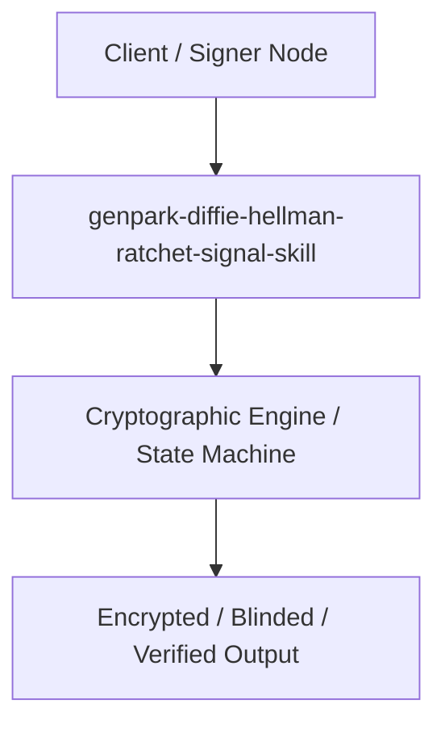

# genpark-diffie-hellman-ratchet-signal-skill

[](https://github.com/alphaparkinc/genpark-diffie-hellman-ratchet-signal-skill)
[](https://github.com/alphaparkinc/genpark-diffie-hellman-ratchet-signal-skill)
[](https://github.com/alphaparkinc/genpark-diffie-hellman-ratchet-signal-skill)

Signal double ratchet state machine advancing symmetric KDF chains and ephemeral Diffie-Hellman keys for forward secrecy.

## Architecture


## Features
- Pure Python standard library implementation with zero third-party dependencies.
- Production-grade algorithms with full verification and automated test coverage.
- Standalone client, MCP protocol server, and execution examples.

## Quickstart
```bash
python example_usage.py
```
